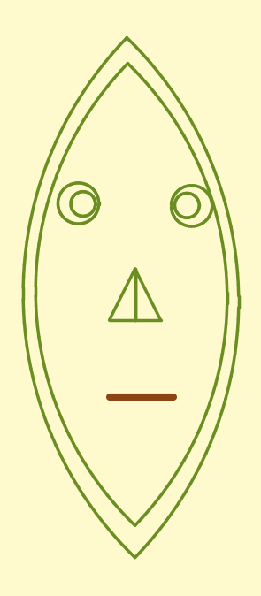

# An African mask, drawn with a turtle

**Microsoft Small Basic · April 2018 · written when I was eleven.**

A mask drawn with the Small Basic Turtle — a cursor you steer with `Move` and `Turn`,
the same idea as Logo. It knows how to go forwards and how to rotate. **It does not
know what a circle is.**

Every curve here is made of straight lines.



---

## The one idea

The face, the eyes and the chin all come out of the same four lines:

```basic
sides = 50

length = 400 / sides
angle  = 90 / sides
For j = 1 To sides
  Turtle.Move(length)
  Turtle.Turn(angle)
EndFor
```

Move a little, turn a little, fifty times. Each step is straight; the accumulated
turning bends the path into an arc.

The part worth pointing at is the **division**. Both the length and the angle are
divided by `sides`, so the total distance travelled is always 400 and the total turn
is always 90° — whatever `sides` is set to. The arc keeps its shape. `sides` only
controls how finely it is drawn.

That makes it a resolution knob, and one number changes every curve in the drawing
at once:

| `sides` | what you see |
|---|---|
| 3 | the trick exposed — three straight lines |
| 6 | recognisably a curve, obviously faceted |
| 12 | smooth unless you look for corners |
| 50 | the eye cannot find them at all |

For a step length $\ell$ and a turn $\theta$ per step, the polygon is inscribed in a
circle of radius $r = \ell / (2\sin(\theta/2))$. With $\ell = 8$ and $\theta = 1.8°$
that is about 255 units, which is why the face fills the window the way it does.

This is roughly what a graphics card does with a curve: flatten it into segments, and
argue only about how many.

## Running it

**Small Basic** — open `turtle-afrincan-mask.sb` in
[Microsoft Small Basic](https://smallbasic-publicwebsite.azurewebsites.net/) and press F5.

**Python**, no Small Basic needed — `turtle_mask.py` reimplements the Turtle
faithfully (Small Basic's Y axis points down and angle 0 points up) and redraws the
same file:

```bash
pip install matplotlib
python turtle_mask.py            # writes mask.png
python turtle_mask.py --sides 6  # the same drawing, coarser
```

## Things that are wrong with it

Kept as they were, because they are the interesting part.

- **The comments describe a different program.** One block is labelled `' Left eye`
  and the next `' Right eye`. They are not: the first draws the *inner* ring of both
  eyes, the second the *outer* ring of both. The code is organised by ring, the
  comments by eye.
- **Three of the four circles never reset their heading.** The first does
  `Turn(-Turtle.Angle)`; the rest just `TurnRight()` from wherever `MoveTo` left them.
  A 360° arc closes on itself either way, so it does not show — but that is luck, not
  design.
- **Everything is a magic number.** 300, 400, 250, 150, 60, 100. Nothing is derived
  from anything else, so moving the face means editing eleven coordinates by hand.
  The `sides` parameter shows the instinct for abstraction was already there; it just
  had not reached the geometry yet.
- **`afrincan`.** The filename has always been misspelled. Renaming it now would be
  tidying up history.

## Why it is still here

I write analysis pipelines now where the whole point is that a parameter is declared
once and everything downstream follows from it. That is the same instinct as dividing
by `sides` — I just have better words for it.

Longer write-up: **[carlaprados.com/lab/turtle-african-mask](https://carlaprados.com/lab/turtle-african-mask/)**

## Licence

MIT — see [LICENSE](LICENSE).
